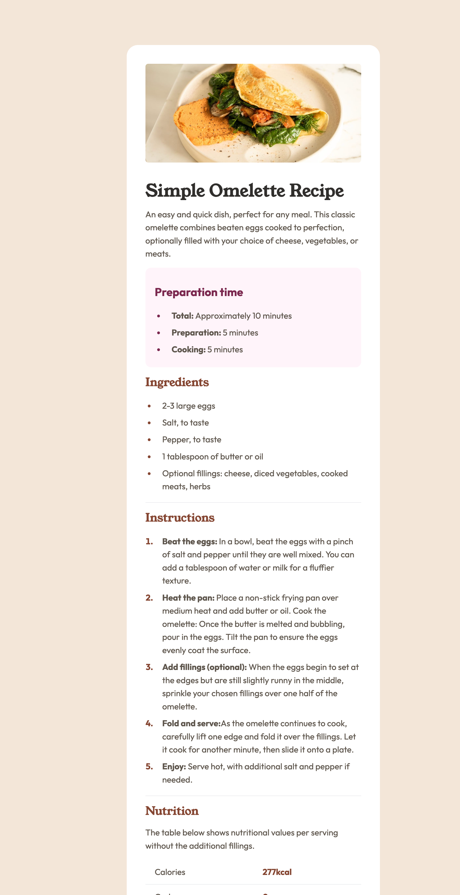

# Frontend Mentor - Recipe page solution

This is a solution to the [Recipe page challenge on Frontend Mentor](https://www.frontendmentor.io/challenges/recipe-page-KiTsR8QQKm).

## Table of contents

- [Overview](#overview)
  - [Screenshot](#screenshot)
  - [Links](#links)
  - [Built with](#built-with)
- [Author](#author)

### Screenshot

### Links

- Live Site URL: [Recipe Page](https://opodartho.github.io/recipe-page)

### Built with

- Semantic HTML5 markup
- CSS custom properties
- Flexbox
- CSS Grid
- Mobile-first workflow
- [tailwindcss](https://tailwindcss.com/) - For styles

## Author

- Github - [@opodartho](https://github.com/opodartho)
- Frontend Mentor - [@opodartho](https://www.frontendmentor.io/profile/opodartho)
